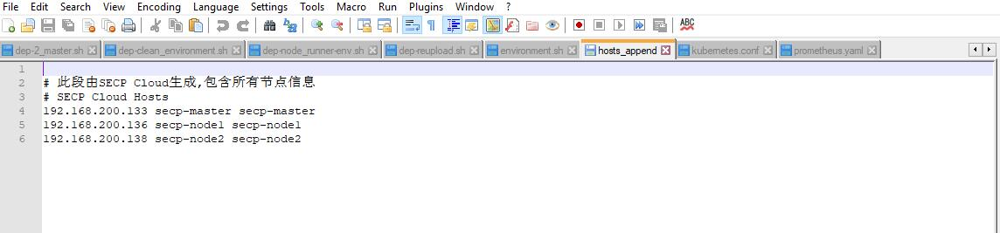
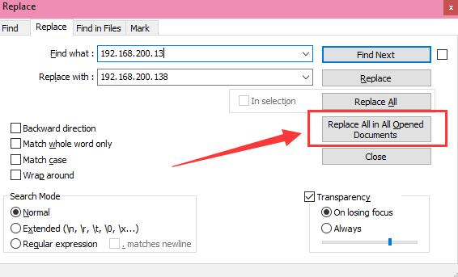
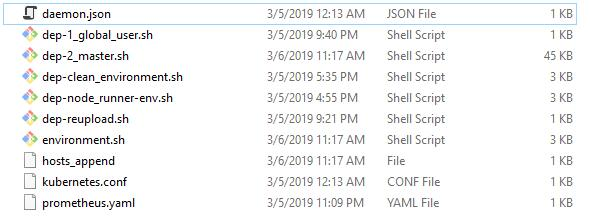

文档作者: HITwh Vegetable Group :: ArHShRn

# 知识版权 Copyright  开源许可 License

文档：版权 ® HITwh很菜的小组 2019

源码（前端、后端Shell以及配置文件）：GNU AGPL v3.0 - 非商业用途、采用开源

Documents: Copyright ® [HITwh Vegetable Group](https://github.com/hitwh-vegetable-group) 2019 

Source Code(Frontend, Backend Shells and Configs): GNU AGPL v3.0 - **Noncommercial, Open Source**

## 版权许可 - 中文

本作品文档采用知识共享 署名-非商业性使用-相同方式共享 4.0 国际 许可协议进行许可。

要查看该许可协议，可访问 http://creativecommons.org/licenses/by-nc-sa/4.0/ 或者写信到 Creative Commons, PO Box 1866, Mountain View, CA 94042, USA。

## Copyright License - English

Documents containing in this work is licensed under the Creative Commons Attribution-NonCommercial-ShareAlike 4.0 International License. 

To view a copy of this license, visit http://creativecommons.org/licenses/by-nc-sa/4.0/ or send a letter to Creative Commons, PO Box 1866, Mountain View, CA 94042, USA.


# SECP 云后台服务器集群部署指南

**请向小组成员联系获取  secp_deployment-x86_64.tgz 部署包 （734MB）**

## 部署准备

- Ubuntu Sever 16.04.5+ LTS 64bit * 3台 (基础 Package 需要齐全)
- 3台服务器节点各自的IP地址（要求静态）
- secp_deployment-x86_64.tgz 部署包 (734MB)

## 部署建议

- 目前为止部署包解压过后占用空间高达 1.07G ，建议内网部署；如果需要外网部署请确保带宽够大以减少部署时间
- **最开始需要在本地计算机进行IP替换**，所以建议用 Notepad++ 对配置文件进行更改（以下对 Notepad++ 简称 npp）

## 部署注意事项

- 部署时间根据节点性能而异，一般在5-10分钟左右
- 目前仅支持3台节点的部署
- **请使用ROOT账户**
- **请在每个节点上保证安装了 lrzsz，并保证用 xShell 或者类似的终端软件连接每个节点进行部署，千万不要用 windows 自带的 ssh 进行部署（因为不支持 lrzsz）**
- 3台服务器节点除开基础 Package 需要齐全之外，**系统必须纯净**；否则所出现的任何情况我们小组不承担任何责任，也没有义务提供解决方案
- 部署期间因为需要下载运行环境，**所以请保持全程联网**，否则所出现的任何情况我们小组不承担任何责任，也没有义务提供解决方案

## SECP 服务器集群详情

- HAProxy + KeepAlived 高可用
  - 一台Master节点
  - 两台Backup节点
- x509 双向认证
- 集成 Prometheus + Node-Exporter + Grafana 单集群/节点/POD 监控方案

## 开始部署

### 1.上传部署包到 Master 节点

请上传部署包到 Master 节点，并检查SHA256是否匹配

```bash
# sha256sum ./secp_deployment-x86_64.tgz
7830fed0971d358ef30da3c91c99106ca6d472c6dd4e0569ee78ef62b08f152c secp_deployment-x86_64.tgz
```

验证无误后解压

```bash
# tar -zxvf ./secp_deployment-x86_64.tgz -C /opt
./secp_deployment-x86_64/
./secp_deployment-x86_64/dep-components/
./secp_deployment-x86_64/dep-components/cfssl/
./secp_deployment-x86_64/dep-components/cfssl/cfssl
./secp_deployment-x86_64/dep-components/cfssl/cfssl-certinfo
./secp_deployment-x86_64/dep-components/cfssl/cfssljson
./secp_deployment-x86_64/dep-components/docker/
./secp_deployment-x86_64/dep-components/docker/debs/
./secp_deployment-x86_64/dep-components/docker/debs/docker-ce-cli_18.09.2~3-0~ubuntu-xenial_amd64.deb
./secp_deployment-x86_64/dep-components/docker/debs/docker-ce_18.09.2~3-0~ubuntu-xenial_amd64.deb
./secp_deployment-x86_64/dep-components/docker/hitwhvg-containerd-utils.deb
./secp_deployment-x86_64/dep-components/docker/hitwhvg-docker-utils.tgz
./secp_deployment-x86_64/dep-components/docker/images/
./secp_deployment-x86_64/dep-components/docker/images/hitwhvg-addon-resizer.tar
./secp_deployment-x86_64/dep-components/docker/images/hitwhvg-grafana.tar
./secp_deployment-x86_64/dep-components/docker/images/hitwhvg-kube.tar
./secp_deployment-x86_64/dep-components/docker/images/hitwhvg-node-exporter.tar
./secp_deployment-x86_64/dep-components/docker/images/hitwhvg-pod-infra.tar
./secp_deployment-x86_64/dep-components/docker/images/hitwhvg-prom-ne.tar
./secp_deployment-x86_64/dep-components/docker/images/hitwhvg-prometheus.tar
./secp_deployment-x86_64/dep-components/docker/images/load_images.sh
./secp_deployment-x86_64/dep-components/docker/images/save_images.sh
./secp_deployment-x86_64/dep-components/docker/images/start_monitor.sh
./secp_deployment-x86_64/dep-components/etcd/
./secp_deployment-x86_64/dep-components/etcd/hitwhvg-etcd-utils.tar.gz
./secp_deployment-x86_64/dep-components/flanneld/
./secp_deployment-x86_64/dep-components/flanneld/hitwhvg-flanneld-utils.tar.gz
./secp_deployment-x86_64/dep-components/golang/
./secp_deployment-x86_64/dep-components/golang/hitwhvg-golang-utils.tar.gz
./secp_deployment-x86_64/dep-components/kubernetes/
./secp_deployment-x86_64/dep-components/kubernetes/hitwhvg-kubernetes-utils.tar.gz
./secp_deployment-x86_64/dep-services/
./secp_deployment-x86_64/dep-services/bt-panel/
./secp_deployment-x86_64/dep-services/bt-panel/install.sh
./secp_deployment-x86_64/dep-services/monitor/
./secp_deployment-x86_64/dep-services/monitor/single_node/
./secp_deployment-x86_64/dep-services/monitor/single_node/HITWHM-NODE Panel.json
./secp_deployment-x86_64/dep-services/monitor/single_node/monitor.yaml
./secp_deployment-x86_64/dep-services/monitor/single_node/prometheus_with_node-exporter/
./secp_deployment-x86_64/dep-services/monitor/single_node/prometheus_with_node-exporter/build.sh
./secp_deployment-x86_64/dep-services/monitor/single_node/prometheus_with_node-exporter/consoles/
./secp_deployment-x86_64/dep-services/monitor/single_node/prometheus_with_node-exporter/consoles/index.html.example
./secp_deployment-x86_64/dep-services/monitor/single_node/prometheus_with_node-exporter/consoles/node-cpu.html
./secp_deployment-x86_64/dep-services/monitor/single_node/prometheus_with_node-exporter/consoles/node-disk.html
./secp_deployment-x86_64/dep-services/monitor/single_node/prometheus_with_node-exporter/consoles/node-overview.html
./secp_deployment-x86_64/dep-services/monitor/single_node/prometheus_with_node-exporter/consoles/node.html
./secp_deployment-x86_64/dep-services/monitor/single_node/prometheus_with_node-exporter/consoles/prometheus-overview.html
./secp_deployment-x86_64/dep-services/monitor/single_node/prometheus_with_node-exporter/consoles/prometheus.html
./secp_deployment-x86_64/dep-services/monitor/single_node/prometheus_with_node-exporter/console_libraries/
./secp_deployment-x86_64/dep-services/monitor/single_node/prometheus_with_node-exporter/console_libraries/menu.lib
./secp_deployment-x86_64/dep-services/monitor/single_node/prometheus_with_node-exporter/console_libraries/prom.lib
./secp_deployment-x86_64/dep-services/monitor/single_node/prometheus_with_node-exporter/Dockerfile
./secp_deployment-x86_64/dep-services/monitor/single_node/prometheus_with_node-exporter/node_exporter
./secp_deployment-x86_64/dep-services/monitor/single_node/prometheus_with_node-exporter/prometheus
./secp_deployment-x86_64/dep-services/monitor/single_node/prometheus_with_node-exporter/prometheus.yml
./secp_deployment-x86_64/dep-services/monitor/single_node/prometheus_with_node-exporter/promtool
./secp_deployment-x86_64/dep-shells/
./secp_deployment-x86_64/dep-shells/daemon.json
./secp_deployment-x86_64/dep-shells/dep-1_global_user.sh
./secp_deployment-x86_64/dep-shells/dep-2_master.sh
./secp_deployment-x86_64/dep-shells/dep-clean_environment.sh
./secp_deployment-x86_64/dep-shells/dep-node_runner-env.sh
./secp_deployment-x86_64/dep-shells/dep-reupload.sh
./secp_deployment-x86_64/dep-shells/environment.sh
./secp_deployment-x86_64/dep-shells/hosts_append
./secp_deployment-x86_64/dep-shells/kubernetes.conf
./secp_deployment-x86_64/dep-shells/prometheus.yaml
```

### 2.对每个结点进行全局配置

首先查看自己三个节点的 IP 地址，我们这儿看起是这样的

```
# SECP Cloud Hosts
192.168.200.133 secp-master secp-master
192.168.200.136 secp-node1 secp-node1
192.168.200.138 secp-node2 secp-node2
```

进入 `/opt/secp_deployment-x86_64/dep-shells` 中，下载所有文件到本地计算机

```
cd /opt/secp_deployment-x86_64/dep-shells
sz *
```

用 npp 打开所有文档，并选择 hosts_append 文件标签，如图



利用 ctrl+H 快捷键替换所有 IP 为自己节点的 IP，注意替换的时候**替换所有打开的文档**



对每个标签页一一保存，然后进入 `/opt/secp_deployment-x86_64/dep-shells` 中运行 `dep-reupload.sh`，其间会提示用户上传文件，选择所有文件上传

```bash
# bash dep-reupload.sh
-----------------------------------------------------
欢迎使用SECP Cloud环境部署脚本 - 脚本更新
在Ansible做成之前，您将持续使用此脚本配置后台基本环境
-----------------------------------------------------
>>  删除所有文件.
>>  等待重新上传...
rz waiting to receive.
>>  转换Unix换行符...
dos2unix: converting file daemon.json to Unix format ...
dos2unix: converting file dep-1_global_user.sh to Unix format ...
dos2unix: converting file dep-2_master.sh to Unix format ...
dos2unix: converting file dep-clean_environment.sh to Unix format ...
dos2unix: converting file dep-node_runner-env.sh to Unix format ...
dos2unix: converting file dep-reupload.sh to Unix format ...
dos2unix: converting file environment.sh to Unix format ...
dos2unix: converting file hosts_append to Unix format ...
dos2unix: converting file kubernetes.conf to Unix format ...
dos2unix: converting file prometheus.yaml to Unix format ...
>>  添加可执行权限...
>>  SECP Cloud 用户环境部署脚本部署完成！
```

将**刚刚所有的文件**上传给各个节点并在各个节点上运行

文件列表



```bash
# rz
```

```bash
# bash dep-1_global_user.sh
>>  -----------------------------------------------------
>>            欢迎使用 SECP Cloud 环境部署脚本
>>  在Ansible做成之前，您将持续使用此脚本配置后台基本环境
>>  -----------------------------------------------------
>>  正在配置环境...
192.168.200.133 secp-master secp-master
192.168.200.136 secp-node1 secp-node1
192.168.200.138 secp-node2 secp-node2
>>  重启网络环境...
>>  SECP Cloud 用户环境部署脚本部署完成！
>>  请务必保证所有节点均运行此脚本，
>>  之后在 Master 节点继续运行 dep-2_master.sh 开始部署 SECP Cloud 服务器集群！
```

**在每个节点上运行 ping 测试是否连接通畅，如果不行，请立刻检查之前步骤是否出错**

```bash
# ping -c 1 secp-master
# ping -c 1 secp-node1
# ping -c 1 secp-node2
```

### 3.开始部署 SECP 服务器集群

在 **Master 节点**上进入 `/opt/secp_deployment-x86_64/dep-shells` 并运行 `dep-2_master.sh`

```bash
# bash dep-2_master.sh
```

首次部署会申请 master 到其他节点的 ssh 免密登陆以方便后续分发组件

```
>>  生成RSA证书用于免密登陆部署其他节点...
Generating public/private rsa key pair.
Enter file in which to save the key (/root/.ssh/id_rsa): 
/root/.ssh/id_rsa already exists.
Overwrite (y/n)? y
Enter passphrase (empty for no passphrase): 
Enter same passphrase again: 
Your identification has been saved in /root/.ssh/id_rsa.
Your public key has been saved in /root/.ssh/id_rsa.pub.
```

之后请耐心等待部署完成

- 请保持全程联网
- 在启动 ETCD 集群的时候因为会重载系统守护者，所以会比较慢，**但是注意此时并没有卡住，请耐心等待，不要发送 ^C！**

## 环境的清理

- 注意，因为 HA 高可用服务的特性，所以请从最后一个节点开始，倒着向前清理环境！
- 注意，最后会打开 ~/.bashrc 以便用户清理 PATH 环境变量

每个节点运行 `dep-clean_environment.sh` 脚本即可